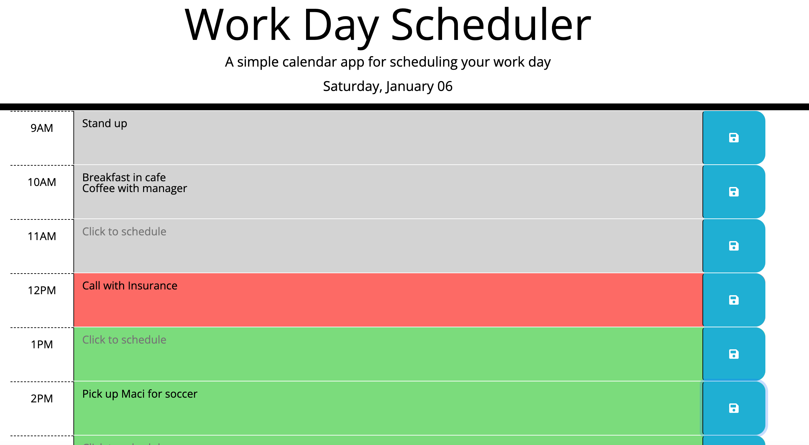

# work-day-scheduler

## Description
A daily planner app that allows the user to save events for each hour of the workday. The planner is set to a standard 9-5 workday.

https://jessicadubina.github.io/work-day-scheduler/

## Installation
N/A

## Usage
Click inside the text field for the hour you would like to schedule an event. Enter the appropriate information and click the save button. 

The planner is color coded to show past events, highlight the current hour, and any future events. 

## Credits
N/A

## License
Please refer to license attached to the project.